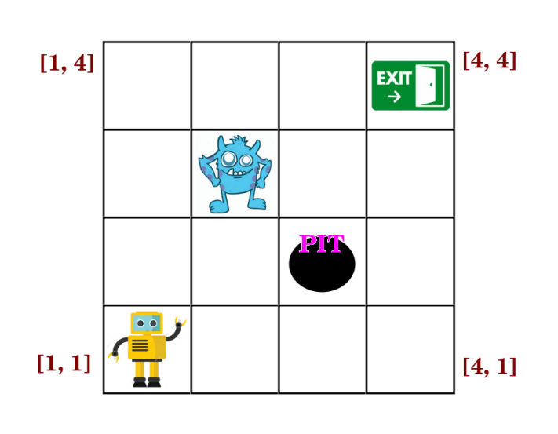

# Wumpus World Agent Pathfinding using Artificial Intelligence
This is a Python implementation of the Wumpus world and a knowledge-based agent to navigate the partially observable environment. The program uses propositional logic sentences to check which rooms are safe and the Davis-Putnam-Logemann-Loveland (DPLL) algorithm to draw inferences, along with several heuristics like pure symbol heuristic, unit clause heuristic, random restart heuristic, and more.

## Problem Statement

Given a Wumpus world containing exactly one pit and one Wumpus agent in room [1,1]. The goal of the agent is to exit the Wumpus world alive. The agent can exit the Wumpus world by reaching room [4,4]. There will be a breeze in the rooms adjacent to the pit, and there will be a stench in the rooms adjacent to Wumpus. Write a Python program that uses Propositional Logic sentences to check which rooms are safe. The inference is drawn using the Davis-Putnam-Logemann-Loveland (DPLL) algorithm. There will always be a safe path that the agent can take to exit the Wumpus world. The logical agent can take four actions: Up, Down, Left and Right. These actions help the agent move from one room to an adjacent room. The agent can perceive two things: Breeze and Stench.